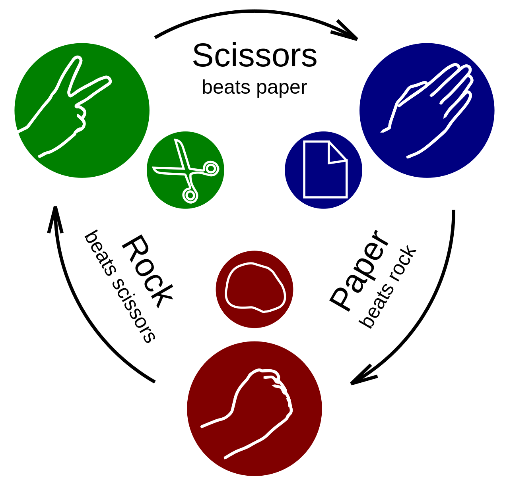

## Rock Paper Scissors Game

### How I did it?

- I use circle technique, so SCISSORS Stronger than PAPER Stronger than ROCK Stronger than Stronger (circle), so it's dynamic you can add new status in circle

 


### How to run

- Install Java 21, for example
```shell
  winget install EclipseAdoptium.Temurin.21.JDK # windows users
``` 

- How to run test cases, run next command

```shell
 .\gradlew test
```

- How to run App, run next command

```shell
 .\gradlew run
 ```